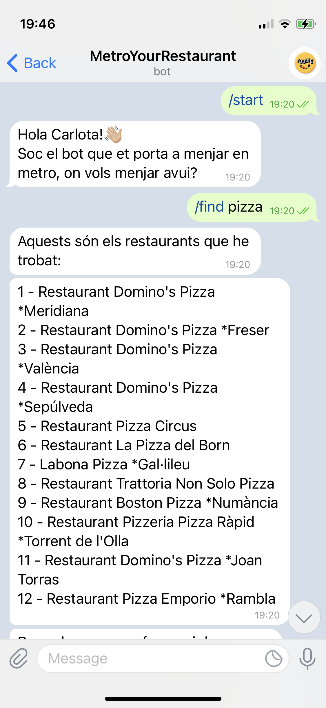
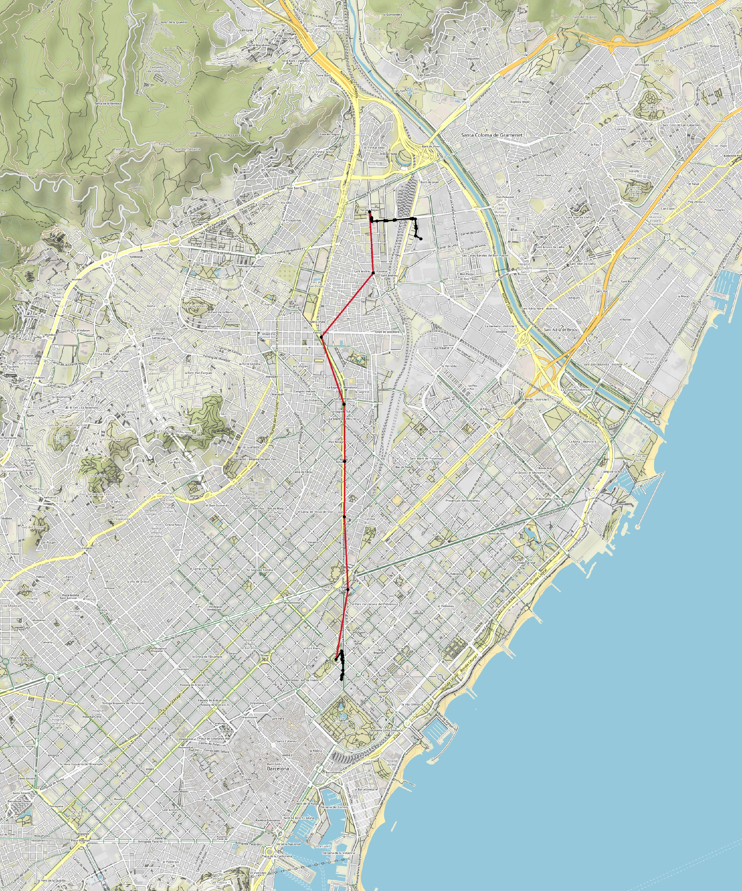

# MetroNyam

Tria restaurant i vés-hi en metro 🍕 🚇

*MetroYourRestaurant*, el bot que et porta en metro al restaurant que tu vols!

## Introducció

El projecte consisteix en un bot de Telegram® desenvolupat amb Python que té com a objectiu guiar l'usuari fins al restaurant que desitja el més rapid possible ja sigui a peu i/o en metro. Això sí, sempre i quan sigui dins de Barcelona!

<p float="left">
  

   
</p>

Vídeo que mostra el funcionament del bot:

[](https://youtube.com/shorts/SMxTKgAOr_o?feature=share)


Per poder dur a terme hem hagut d'usar les següents dades:
- El mapa dels carrers de Barcelona obtingut d'[Open Street Map](https://www.openstreetmap.org).

- La [llista d'equipaments de restaurants de la ciutat de Barcelona](https://opendata-ajuntament.barcelona.cat/data/ca/dataset/equipament-restaurants).

- La [Llista de les estacions de Metro de TMB](https://developer.tmb.cat/data/estacions).

- La [Llistat dels accessos de Metro de TMB](https://developer.tmb.cat/data/accessos).


## Instruccions
Per tal de poder utilitzar el bot, primer l'usuari haurà de tenir instal·lada l'aplicació Telegram®. Posteriorment, s'haurà de registrar i a l'apartat de **xats** haurà de buscar `MetroYourRestaurant` per poder rebre les indicacions correctes per arribar al restaurant desitjat.

Per inicialitzar el bot haurà d'introduir la comanda `/start`, a més podrà obtenir informació addicional de totes les comandes disponibles introduint `/help`, aquesta li mostrarà un llistat i només cal que segueixi les indicacions que el mateix bot li anirà proporcionant.

#### Comandes disponibles
`/start` Inicialitza el bot. Indispensable cada cop que s'inicialitzi una nova conversa amb el bot.

`/help` Mostra llistat de les comandes disponibles i la funcionalitat d'aquestes. 

`/author` Informa a l'usuari dels creadors del bot. 

`/find <query>` Retorna una llista de màxim 12 restaurants que satisfan la cerca feta per l'usuari. En el cas de fer servir cerca multiple amb n paraules, cal fer servir la següent notació: /find <query(1)>;<query(2)>; ... <query(n-1)>;<query(n)>

`/info <number>` Mostra la informació del restaurant especificat amb el nombre de la llista anterior. 

`/guide <number>` Mostra el camí més ràpid (de forma visual) des d'on es troba l'usuari fins al restaurant demanat (a través del número amb el que s'identifica a la llista anterior) i mostra instruccions per facilitar el camí a l'usuari de forma escrita. 

`/travel_time` Diu el temps que es trigarà a fer la última ruta que s'ha executat amb */guide <number>*

`/accessibility <SI/NO>` Indica al bot si l'usuari vol que la ruta exclogui els accessos NO accessibles. 

## Requeriments
Per tal de poder utilitzar sense cap problema el bot implementat, caldrà instal·lar les llibreries adjuntes en el fitxer `requirements.txt`.

## Funcionalitat dels moduls
### Restaurants
El mòdul `restaurants.py` recull la definició de la classe Restaurant amb tots els atributs que necessitarem durant tot el projecte.

```python3
@dataclass
class Restaurant: ...
    
Restaurants: TypeAlias = List[Restaurant]
```

També és l'encarregat de llegir totes les dades necessàries del fitxer **restaurants.csv** i assignar cada atribut la columna del fitxer que li pertoca. 
    
```python3
def read_restaurants() -> Restaurants: ...
```  
També trobem la implementació dels diferents tipus de cerques (múltiple i difusa) per tal de que quan l'usuari busqui un restaurant, el bot sigui capaç de retornar-li una llista que la satisfaci.
    
```python3
def get_dictionary(restaurants: Restaurants) -> Dict[str, Restaurant]: ...
def find_matching_restaurants(list_query: List,
                              restaurants: Restaurants) -> Restaurants: ...
def find_restaurants(query: str, restaurants: Restaurants) -> Restaurants: ...
```
  
La funció `find_matching_restaurants` s'ha implementat de tal manera que si es dona una cerca (ja sigui una única paraula o múltiples) retorna una llista "matching_restaurants" amb els restaurants que satisfan la cerca. 
Aquesta ha estat implementada utilitzant la cerca difusa, i segueix la següent estructura:

Es recorren tots els restaurants de la llista donada i es guarden els atributs. Seguidament es recorre la query donada (que és un string d'una o múltiples paraules) mentre iterem pels atributs guardats anteriorment. 
  
En aquest punt, es comprova si algun dels atributs del restaurant en qüestió té semblança suficient amb la query com per considerar-lo part de la llista que es retornarà. Això es repetirà per totes les paraules que es tinguin a la query. A mida que es van recorrent els restaurants, s'emmagatzema el ratio de semblança que els hi correspon a cadascun per a cada query. Aquest ratio de semblança es guarda en un diccionari. Aquest últim pas només es duu a terme quan la semblança és suficientment important com per considerar el restaurant potencialment part de la llista que demana l'usuari. 
  
Se seguirà aquest patró per tractar tots els restaurants.
  
Un cop recorreguts tots els restaurants i haver-los-hi assignat un ratio, seran ordenats en funció del grau de coincidència, fent servir el diccionari esmentat prèviament. 
 
Si un cert restaurant és suficientment semblant a la query seguint el criteri establert en el codi, aquest s'afegeix a la llista matching_restaurants.
  
**Observació**: Tot i que un restaurant tingui un ratio assignat, no significa que hagi d'aparèixer a la llista, ja sigui perquè hi ha 12 restaurants amb més preferència, o perquè el seu ratio no supera els mínims d'admissió. 
  
  
**Nota**: La cerca difusa, ens permetrà trobar resultats semblants a les cerques introduides, és a dir, mitjançant un cert ratio (i en funció d'aquest aplicarà la distància de Levenshtein) decidirà si el resultat trobat per la cerca és un bon resultat o no. `fuzz.ratio` és la funció que farà això possible. 
  
**Nota**: Per poder fer la cerca múltiple, l'string d'entrada, enlloc d'estar separat per espais haurà d'estar separat per ";". Exemple: /find pizza;sants.

    
### Metro
El mòdul `metro.py` recull la definició de les següents classes: Station, Access, Edge.
```python3
@dataclass
class Station:
    ...

@dataclass
class Access:
    ...

@dataclass
class Edge:
    ...

Point: TypeAlias = Tuple[float, float]  # punt sobre el pla de coordenades de Barcelona
MetroGraph: TypeAlias = nx.Graph    
Stations: TypeAlias = List[Station]
Accesses: TypeAlias = List[Access]
``` 
L'objectiu d'aquest mòdul és crear el graf de la xarxa de metro de Barcelona. Per poder aconseguir-ho primer s'ha implementat una funció per obtenir les dades necessàries dels fitxers **estacions.csv** i **accessos.csv** i assignar a cada atribut la columna del fitxer que li pertoca. 
    
```python3
def read_stations() -> Stations: ...
def read_accesses() -> Accesses: ...
```     
Per tal de poder afegir els nodes i les arestes al graf del metro, s'han implementat les següents funcions que afegeixen els nodes i les arestes de les estacions, els nodes i arestes dels accessos i les arestes de transbord. Aquesta última tracta les atrestes de tipus "Enllaç".
    
En aquest procés de construcció del graf ja s'està obtenint i guardant dades que seran utils per poder continuar amb la realització del projecte. Dins d'aquestes dades es poden trobar les següents: 
  
En el cas de les arestes, es guardaran els següents atributs: tipus, distància, color, i coordenades (dels dos nodes extrems que la formen).
  

D'altra banda, els nodes els conformen: id, tipus, nom, línia i  coordenades en el cas dels nodes de tipus estació i id, tipus, nom, coordenades i accessibilitat en el cas dels nodes de tipus accés.
  
  
```python3
def add_nodes_and_edges_stations(station1: Station, station2: Station,
                                 metro_graph: MetroGraph) -> None: ... # Sempre hi haurà un node que estarà ja afegit (menys la primera crida), però es fa d'aquesta manera per afegir totes les arestes de tipus Tram correctament i alhora.
def add_edges_accesses(
        qty_stations: int, all_stations: Stations, all_accesses: Accesses,
        metro_graph: MetroGraph) -> None: ... # Afegeix les arestes des dels accessos a la estació que li correspon a cada accés. 
def add_nodes_accesses(all_accesses: Accesses,
                       metro_graph: MetroGraph) -> None: ... # Afegeix tots els nodes de tipus accés
def add_link_edges(all_stations: Stations,
                   metro_graph: MetroGraph) -> None: ... # Afegeix totes les arestes de transbord
```
També han estat implementades tres funcions auxiliars. Dues que ajuden a la lectura i emmagatzemament de les dades dels arxius `.csv`(de la forma en la que es comenta posteriorment) i una altra que obté la distància entre dos punts. 
    
```python3
def get_accessibility(info: str) -> bool: ... # Donat un string ("Accessible" o "No Accessible") retorna el booleà corresponent a l'string
def get_coordinates(info: str) -> Point: ... # Donat un string ("Point(x,y)" on x i y son coordenades) retorna el seu Point corresponent
def getdistance(point1: Point, point2: Point) -> float: ... # Donats dos punts, retorna la distància entre aquests. 
```

En quant a la presentació del graf del metro de Barcelona, han estat implementades diverses funcions les quals permeten imprimir un graf més senzill que només mostren els nodes pintats de blau i arestes pintades de negre. Després, afegint els nodes i les arestes del graf (i fent ús de la informació que contenen aquests) s'aconsegueix que el graf s'imprimeixi ja amb les arestes del color corresponent, sobre del mapa de la ciutat de Barcelona amb l'ajuda del mòdul `StaticMap` i guardant aquesta imatge en un fitxer `.png`.

    
```python3
def show(metro_Graph: MetroGraph) -> None: ... # dibuixa el graf "senzill" amb les arestes negres i els nodes blaus
def plot(g: MetroGraph) -> None: ... # desa el mapa de la ciutat com a imatge
def add_lines(m: StaticMap, g: MetroGraph) -> None: ... # afegeix les arestes del graf al StaticMap
def add_nodes(m: StaticMap, g: MetroGraph) -> None: ...  # afegeix els nodes del graf al StaticMap 
```

Per a la creació del graf, només s'ha implementat una funció que retorna el graf del metro de Barcelona amb la informació dels dos arxius llegits anteriorment. Per dur a terme aquesta construcció, la funció següent fa ús de totes les funcions esmentades prèviament. 
    
```python3
def get_metro_graph() -> MetroGraph: ...
```

### City
El mòdul `city.py` recull la definició dels següents tipus:
```python3
CityGraph: TypeAlias = nx.Graph  # graf no dirigit de networkx
OsmnxGraph: TypeAlias = nx.MultiDiGraph  # MultiDiGraph: graf dirig multiArc (possiles arestes repetides entre els mateixos parells de nodes)
Coord: TypeAlias = Tuple[float, float]  # (latitude, longitude)
NodeID: TypeAlias = Union[int, str]
Path: TypeAlias = List[NodeID]
```

Els **nodes** del *CityGraph* estaran formats pels següents atributs:        
- En cas que el node sigui de tipus access: (id, tipus, nom, coordenades)                 
- En la resta de casos: (id, tipus, nom, nom de linia, coordenades)   
- **tipus de Nodes**: Street, Station, Access; per trobar el path també es fa ús dels nodes Src i Dst, que se'ls hi ha assignat aquest nou tipus.                                                        
                                                                        
Les **arestes** del *CityGraph* estaran formades pels següents atributs: (edge[0], edge[1], time, attr)                                     
- edge[0], edge[1] representa on comença i acaba l'aresta
- time = el temps que trigarà l'usuari en recórrer l'aresta en qüestió.
- attr serà una instància de la classe Edge que recollirà: tipus, distància i color.                
- **tipus d'Edges**: Link, Railway, Access, Street                         

La finalitat d'aquest mòdul és fusionar dos grafs, el graf del metro de Barcelona que s'ha creat amb el mòdul `metro.py` i el graf dels carrers de la ciutat de Barcelona, que s'obté a través del mòdul `osmnx` com un *MultiDiGraph* de `networkx`. Per l'obtenció d'aquest graf, caldrà connexió a internet doncs el mòdul en qüestió el descarrega a través de la xarxa. 
    
Per a la creació del graf dels carrers de Barcelona (*OsmnxGraph*), s'han implementat diverses funcions. Per descarregar-lo, guardar-lo i carregar-lo (en cas que ja s'hagi descarregat i guardat prèviament).

```python3
def get_osmnx_graph() -> OsmnxGraph: ... # retorna el graf dels carrers de Barcelona
def save_osmnx_graph(g: OsmnxGraph, filename: str) -> None: ... # guarda el graf en un fitxer filename
def load_osmnx_graph(filename: str) -> OsmnxGraph: ...  # retorna el graf guardat del fitxer filename
```

Per a afegir nodes i arestes del *CityGraph*, s'afegirà el graf del metro *MetroGraph* i el graf dels carrers de la ciutat *StreetGraph* a un graf buit, a més també s'observa que cal enllaçar els accessos del metro amb el node més proper del *StreetGraph* , per tant s'implementa una altra funció amb aquest fi. Per poder fer aquests enllaços, caldrà fer ús de la funció `nearest_nodes` que farà servir la sortida de la funció *get_access_coords()*. 
**Nota**: la funció `nearest_nodes` del mòdul `osmnx` rep essencialment tres paràmetres: el graf del qual es vol trobar els nodes més propers, la llista de les coordenades *x* dels nodes en qüestió, i la llista de les coordenades *y* dels nodes en qüestió. 

```python3
def add_Metro_Graph(city_graph: CityGraph, metro_graph: MetroGraph) -> None: ... # afegir el graf del metro
def add_Street_Graph(city_graph: CityGraph, street_graph: OsmnxGraph) -> None: ... # afegir el graf dels carrers
def get_access_coords(metro_graph: MetroGraph, y: List, x: List,
                      access_nodes: List) -> None: ... # retorna i modifica les llistes dels accessos i les seves coordenades
def link_Street_with_Access(city_graph: CityGraph, street_graph: OsmnxGraph,
                            metro_graph: MetroGraph) -> None: ... # enllaç d'accessos i node més proper del StreetGraph
```
 
Finalment construim el graf de la ciutat fent crides a cadascuna de les funcions definides anteriorment.
    
```python3
def build_city_graph(street_graph: OsmnxGraph, metro_graph: MetroGraph,
                     accessibility: bool) -> CityGraph: ... # fusio dels dos grafs
```

També s'ha creat una funció que elimina els accessos no accessibles del graf de la ciutat per quan l'usuari vulgui modificar l'accessibilitat.
  
```python3
def delete_unaccessible_accesses(city_graph: CityGraph,
                                 metro_graph: MetroGraph) -> None: ... # Elimina els accessos no accessibles del graf de la ciutat
```
  
Per mostrar-lo, s'ha seguit una metodologia semblant al que s'ha fet per la presentació del graf del metro. S'han implementat varies funcions per tal d'aconseguir dibuixar el *CityGraph* per pantalla. Després es millora aquesta mostra desant aquest graf sobre el mapa de Barcelona, gràcies a l'ajuda de l'StaticMap. Per poder aconseguir mostrar-lo sobre la imatge del mapa de Barcelona, s'han d'afegir els nodes i les arestes del graf de la ciutat sobre el mapa.

```python3
def show_city(city_graph: CityGraph) -> None: ... # dibuixa per pantalla el CityGraph (nodes blaus i arestes negres)
def plot_city(g: CityGraph, filename: str) -> None: ... # guarda el citygraph dins d'un arxiu filename
def add_city_nodes(m: StaticMap, g: CityGraph) -> None: ... # afegeix els nodes del graf a l'StaticMap
def add_city_lines(m: StaticMap, g: CityGraph) -> None: ... # afegeix les arestes del graf a l'StaticMap
```

Per tal de poder trobar el camí més ràpid que portarà l'usuari al restaurant desitjat, s'han creat dues funcions. La primera que retorna el camí més rapid donats un destí i un origen i la segona que calcula el temps aproximat de durada de la ruta, ja que com a punt inicial del camí s'agafa el node de tipus Street més proper a l'origen i com a punt final del camí el node de tipus Street més proper al destí. Es diu que aquest és un temps aproimat ja que no s'està tenint en compte el temps d'anada des de l'origen fins al punt considerat com inici del camí i el temps d'anada des del punt final de la ruta fins al destí.
  
També s'implementa una funció que estableix les velocitats mitjanes a la qual una persona travessa una aresta d'un cert tipus, i a partir d'aquesta informació, retorna el temps que tardarà l'usuari en travessar-la.
  
**Nota**: S'ha escollit dibuixar el camí seguint aquest criteri degut a que la alta densitat dels carrers i interseccions d'aquests de la ciutat de Barcelona, fa que començar pel node considerat com punt inicial i acabar en el node considerat com a punt final, té un grau de simulitud molt alt amb el camí que es faria començant per l'origen donat i acabar en el destí donat.
    
```python3
def find_path(street_graph: OsmnxGraph, city_graph: CityGraph, src: Coord,
              dst: Coord) -> Path: ... # Retorna el camí més curt prenent com a pes el temps
def get_time_path(path: Path, city_graph: CityGraph) -> float: ... # Retorna el temps total aproximat en recorrer un camí fent servir velocitats assignades
def get_travel_time(type: str, distance: float) -> float: ... # Donada una aresta retorna el seu temps de travesia
```

Per pintar el camí que l'usuari ha de seguir per arribar al seu destí, s'ha creat una funció que dibuixa el camí sobre el mapa de Barcelona amb ajuda de l'StaticMap i per poder aconseguir-ho s'han afegit les arestes del graf sobre el mapa.

```python3
def plot_path(city_graph: CityGraph, path: Path, filename: str,
              orig_coords: Coord, dst_coords: Coord) -> None: ... # dibuixa el camí
def add_path_lines(m: StaticMap, g: CityGraph, path: Path) -> StaticMap: ... # afegeix les arestes
```
    
### Bot
L'objectiu del mòdul `bot.py` és dur a terme la gestió de les comandes que rep el bot part d'un usuari, que el bot sigui capaç d'entendre-les i guiï l'usuari al restaurant que desitja indicant-li la ruta més ràpida, ja sigui en metro i/o a peu.
Abans de rebre cap comanda, el bot inicialitzarà el graf de Barcelona (tant amb accessos no accessibles com sense) per tal que quan rebi les primeres comandes ja pugui respondre el més ràpid possible. 
Per poder donar resposta a les comandes que rebi el bot, s'han definit diferents funcions. 
    
```python3
# les comandes estan especificades a l'inici
def start(update, context): ...
def help(update, context): ...
def author(update, context): ...
def find(update, context): ...
def info(update, context): ...
def guide(update, context): ...
def time(update, context): ...
``` 

I també s'han creat algunes auxiliars per acabar de completar les anteriors.

```python3
def initialize(update, context): ... # inicialitza les dades per poder comprovar si s'han efectuat comandes i notificar sobre errors possibles a l'usuari
def accessibility(update, context): ... # Actualitza l'accessibilitat que vol l'usuari
def indicate_path(path: Path, g: CityGraph, update, context) -> None: ... # dona indicacions per a facilitar el camí a l'usuari de forma escrita
def where(update, context): ... # emmagatzema la ubicació enviada per l'usuari
```
**Nota**: Com que no es té constància dels noms dels carrers de Barcelona, a la funció *indicate_path()* no es podrà indicar per quins carrers cal anar. Per tant aquesta ruta, només inclourà els trams de metro i accessos que cal agafar (incloent línia i indicacions de transbord) i el·lidirà indicacions de canvi de carrer. Per tant la part de la ruta que sigui caminant, no tindrà cap indicació concreta, només una de genèrica. 

A més, si l'usuari introdueix comandes amb valors incorrectes, és a dir, que no s'adeqüen a l'estructura de la comanda en qüestió, s'envia un missatge informant del problema.

**Observació**: Al final del codi s'obté el token del bot i s'engega aquest fent ús de les línies de codi `updater.start_polling()` i `updater.idle()`, a la vegada que també es crea el vincle entre les funcions i el nom de la comanda mitjançant els *dispatchers*.
    
### Resultat final del camí
Mostra el camí més ràpid que l'usuari ha de seguir si està situat al CC La Maquinista per poder arribar al Restaurant Japonès Nou Sushi Aburi a Sarrià-Sant Gervasi.
  
S'ha decidit utilitzar aquesta ruta de mostra ja que és una ruta llarga i amb trams a peu i en metro.


<p float="left">
  
</p>
    

## Informació addicional
- Totes les dades utilitzades per a la realització del bot, han estat extretes dels fitxers de dades els quals es poden trobar adjunts al projecte.

Per instalar el packet fuzzywuzzy: 
```
pip3 install fuzzywuzzy  
```
Source: https://pypi.org/project/fuzzywuzzy/

- En cas que l'usuari es trobi fora de Barcelona i enviï la seva ubicació real, es crearà una aresta fins al node mes proper que sí estigui inclòs al graf de la ciutat de Barcelona i d'allà ja farà el camí correcte.
  
- A l'hora de retornar la llista de restaurants que satisfan la cerca, no només es retornen aquells que la satisfan al 100%, sinó que si es troba algun (en el cas de cerca múltiple) on alguna de totes les paraules introduïdes no es troba, també es retorna, ja que s'ha pensat que tot i que no es compleixin totes les paraules cercades, si el restaurant compleix els requisits mínims establerts és preferible retornar-lo i que l'usuari decideixi si és del seu interès, ja que satisfà gairebé la cerca completa.
    
## Autors
Aquest projecte ha estat creat per Marc Camps i Carlota Gozalbo, estudiants del 1r curs del Grau en Ciència i Enginyeria de Dades a la Universitat Politècnica de Catalunya.
    
